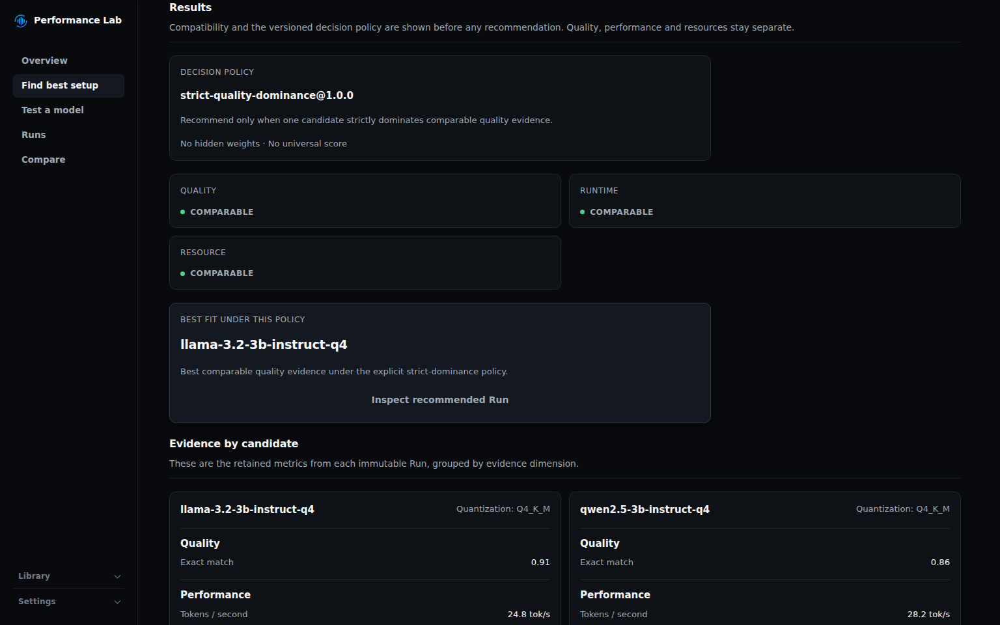
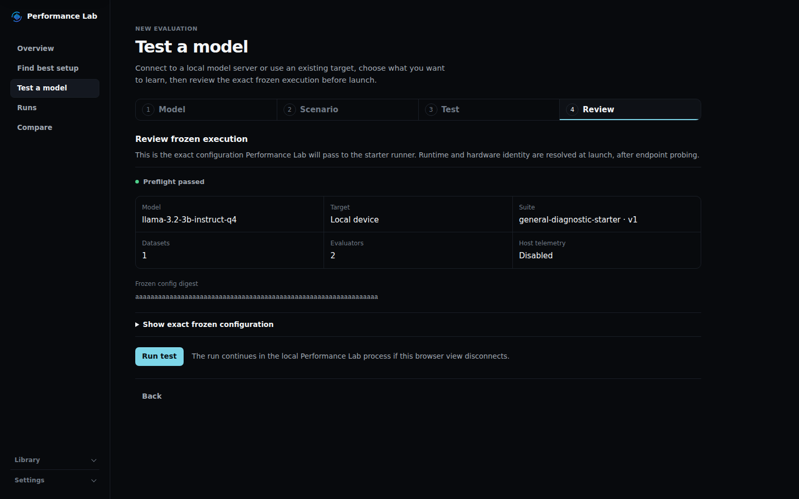
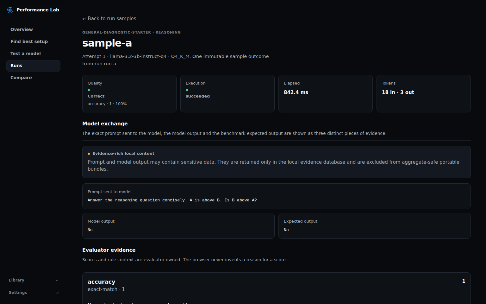

<p align="center">
  
</p>

<h1 align="center">Performance Lab</h1>

<p align="center">
  <strong>Choose the right model for the job — on the device that has to run it.</strong>
</p>

<p align="center">
  Use-case-first evaluation for <strong>model × configuration × device</strong> decisions, grounded in quality, performance and resource evidence.
</p>

<p align="center">
  <a href="#why-performance-lab">Why</a> ·
  <a href="#how-it-works">How it works</a> ·
  <a href="#see-the-product">Product</a> ·
  <a href="#quick-start">Quick start</a> ·
  <a href="#evidence-not-an-opaque-score">Evidence</a> ·
  <a href="#documentation">Docs</a>
</p>

<p align="center">
  <a href="https://github.com/daniele21/performance-lab/actions/workflows/validate.yml"></a>
  <a href="LICENSE"></a>
</p>

## Why Performance Lab

Once you have more than one model, quantization or runtime configuration, a generic leaderboard stops answering the deployment question that matters:

> **For this use case on this device, which available model and configuration gives me the best evidence-backed trade-off — and why?**

Performance Lab evaluates the candidates that are actually available to you against the requirements of a specific workload. It maps the use case to relevant benchmarks and datasets, executes candidate configurations through an external inference endpoint, keeps quality, runtime performance and resources as separate evidence dimensions, checks whether evidence is compatible before comparing it, and preserves the evidence behind the decision.

It is deliberately **not another generic LLM leaderboard**. A model name by itself is not a deployment answer, and an unavailable measurement is never repaired into a fake score.

Performance Lab also does **not** own model loading or inference-runtime lifecycle. Serving stays external; the lab owns evaluation, evidence, comparison, regression and decision support.

## How it works

```text
Use case + target device
          ↓
Relevant benchmarks / datasets
          ↓
Models × quantizations × runtime configurations
          ↓
Quality   ·   Performance   ·   Resources
          ↓
Compatibility + explicit decision policy
          ↓
Best supported trade-off — or an explicit reason not to rank
```

| Evidence dimension | Question it answers |
| --- | --- |
| **Quality** | Does this model/configuration produce the right result for the workload? |
| **Performance** | How fast does it execute under the observed runtime conditions? |
| **Resources** | What does the execution cost on the target device when source-backed resource evidence is available? |

Benchmark relevance comes from the use case. Compatibility comes before deltas and rankings. Unknown or unavailable evidence stays unknown or unavailable.

## See the product

<table>
  <tr>
    <th>Find best setup</th>
    <th>Test a model</th>
    <th>Inspect the evidence</th>
  </tr>
  <tr>
    <td align="center"><a href="docs/assets/readme/find-best-setup.png"></a></td>
    <td align="center"><a href="docs/assets/readme/test-a-model.png"></a></td>
    <td align="center"><a href="docs/assets/readme/sample-evidence.png"></a></td>
  </tr>
  <tr>
    <td align="center">Choose a use case and compare eligible candidates</td>
    <td align="center">Run one explicit model/configuration</td>
    <td align="center">Trace the result back to sample-level evidence</td>
  </tr>
</table>

These are deterministic product captures used to show the current browser experience. They are not physical-device performance evidence.

## What you can do today

- **Find the best setup** — start from a use case, target device and candidate models/configurations; Performance Lab plans relevant evaluation work and returns an evidence-backed recommendation when the evidence permits one.
- **Test a model** — connect an inference endpoint, freeze the evaluation configuration, execute it and inspect the resulting run.
- **Inspect sample evidence** — see execution status separately from evaluator-owned quality, then inspect the prompt sent to the model, model output, expected output, evaluator result, latency, tokens and provenance when retained/available.
- **Compare compatible runs** — differences are shown only after the relevant model/runtime/configuration/dataset/evaluator identities permit comparison.
- **Gate regressions** — reuse immutable run evidence, explicit baselines and regression policies when replacing a model or runtime configuration.
- **Export portable evidence** — completed runs can be exported as `.plab.zip` bundles without silently inventing missing identity, telemetry or sensitive content.

## Evidence, not an opaque score

Performance Lab keeps several invariants visible instead of collapsing everything into one universal number:

- **Use case first.** Benchmark relevance follows the workload objective.
- **Execution identity is explicit.** Model name alone is not enough; quantization, runtime/configuration, endpoint, dataset/evaluator and hardware identity remain part of reproducible evidence when known.
- **Execution success is not correctness.** A request can execute successfully and still produce the wrong answer; evaluator-owned quality is shown separately.
- **Compatibility before comparison.** No delta, ranking or regression verdict is produced across evidence that should not be compared.
- **Unknown stays unknown.** Missing telemetry, identity or content is never rendered as zero.
- **Completed evidence is immutable.** Run evidence and dataset snapshots are versioned and reproducible.

For interactive **Test a model** runs started from the browser, Performance Lab can retain the exact prompt and model output in a local-only evidence sidecar so sample inspection can show what was actually tested. That sensitive content is kept outside canonical portable Run JSON and `.plab.zip` bundles. Campaign and CLI evaluation remain aggregate-safe by default.

See [`docs/output-and-evidence-reference.md`](docs/output-and-evidence-reference.md) for the full persistence, retention and bundle contract.

## Supported inference boundary

The current executable product evaluates text-generation endpoints through an OpenAI-compatible adapter. The minimum surface is:

```text
GET  /v1/models
POST /v1/chat/completions
```

For non-streaming chat, `choices[0].message.content` is the required model output. `model`, `finish_reason` and token usage are consumed when available; provider-specific identity/configuration is never guessed into the execution fingerprint.

[`daniele21/local-llm-server`](https://github.com/daniele21/local-llm-server) / Korgis can additionally expose:

```text
GET /v1/runtime/identity   # stable execution identity
GET /status                # dynamic runtime telemetry
```

Those endpoints enrich first-party evidence but are not required for generic black-box evaluation. See [`docs/local-llm-server-integration.md`](docs/local-llm-server-integration.md) and [`docs/local-llm-identity-contract.md`](docs/local-llm-identity-contract.md).

## Quick start

You need an externally served OpenAI-compatible model endpoint plus the repository-pinned local toolchain. `main` is the stable/release-oriented branch; `dev` is the integration line for ongoing development.

### 1. Prepare the checkout

```bash
git clone https://github.com/daniele21/performance-lab.git
cd performance-lab
git switch main
git pull --ff-only
```

### 2. Install the pinned environment

Current repository pins:

- `uv 0.12.5`;
- Python `3.12` by default;
- Node `24.18.0`;
- pnpm `11.24.0`.

With `uv` and Node/Corepack available:

```bash
uv python install 3.12
uv sync --extra dev --locked

corepack enable
corepack install --global pnpm@11.24.0
pnpm --dir frontend install --frozen-lockfile
```

`uv` owns the repository `.venv`; `uv.lock` and `frontend/pnpm-lock.yaml` are the dependency sources of truth.

### 3. Point Performance Lab at a model

Probe the endpoint first:

```bash
uv run --extra dev --locked performance-lab probe \
  --base-url http://127.0.0.1:1235/v1/ \
  --model my-model
```

Create `local-run.json`:

```json
{
  "schema_version": 1,
  "target_id": "local-model",
  "endpoint_identity": "127.0.0.1:1235",
  "endpoint": {
    "profile_id": "local-endpoint",
    "base_url": "http://127.0.0.1:1235/v1/",
    "model_selector": "my-model"
  },
  "model_id": "my-model",
  "store_path": ".performance-lab/runs.sqlite3"
}
```

If the endpoint is Local LLM Server, the run configuration can also add explicit runtime identity and telemetry blocks. See [`docs/run-config-reference.md`](docs/run-config-reference.md).

### 4. Start the browser product

```bash
pnpm --dir frontend run build

uv run --extra dev --locked performance-lab-ui \
  --config local-run.json \
  --assets frontend/dist
```

Open:

```text
http://127.0.0.1:8765
```

The UI and API are served by the same loopback-owned process. Stop it with `Ctrl-C`; model serving remains external.

For a complete first-run walkthrough, frontend development mode, CLI-only execution and troubleshooting, use [`docs/getting-started.md`](docs/getting-started.md).

## How the pieces fit

```text
OpenAI-compatible endpoint / Local LLM Server
                    |
                    v
             Performance Lab
   evaluation · evidence · comparison
        regression · decision support
                    |
                    v
       immutable SQLite Run evidence
          + portable .plab.zip
```

The inference runtime owns model loading, residency, scheduling and backend execution. Performance Lab consumes the endpoint and any explicit identity/telemetry it exposes; it does not silently take over runtime lifecycle.

## Evidence and maturity

The current browser product includes Overview, **Find best setup**, **Test a model**, Live Run recovery, Runs / Run Detail, Compare, benchmark/sample/same-case evidence drill-down, Library and Settings.

Repository-owned automated workflows validate deterministic Python/frontend contracts, browser critical journeys, PRE_REAL product flows and the assembled packaged product. Those hosted environments prove product behavior at their declared fidelity; they do **not** prove representative physical-device model performance, memory, thermal behavior or repeated-load characteristics.

Representative-human UX acceptance and representative real-model/runtime/device evidence remain separate gates for claims that depend on them. See [`docs/current-state.md`](docs/current-state.md) for the exact integrated/blocker/next state.

## Develop and validate

Contributors work against `dev` and follow [`AGENTS.md`](AGENTS.md). Canonical commands live in [`.engineering/commands.json`](.engineering/commands.json).

Common deterministic gates:

```bash
uv run --extra dev --locked python scripts/validate.py
pnpm --dir frontend run check
pnpm --dir frontend run test
pnpm --dir frontend run build
```

Complete deterministic Python product E2E:

```bash
uv run --extra dev --locked python -m pytest tests/e2e -v --tb=short
```

PRE_REAL browser evidence:

```bash
uv run --extra dev --locked python scripts/pre_real_e2e.py \
  --output-root build/pre-real-e2e
```

Toolchain/dependency, CI-selector and release-promotion changes use the stronger validation profile required by the repository engineering contract.

## Documentation

| Question | Canonical source |
| --- | --- |
| First setup / run | [`docs/getting-started.md`](docs/getting-started.md) |
| Current integrated / blocked / next state | [`docs/current-state.md`](docs/current-state.md) |
| Run configuration | [`docs/run-config-reference.md`](docs/run-config-reference.md) |
| CLI commands | [`docs/cli-reference.md`](docs/cli-reference.md) |
| Evidence / retention / bundles | [`docs/output-and-evidence-reference.md`](docs/output-and-evidence-reference.md) |
| Architecture / ownership | [`docs/architecture.md`](docs/architecture.md) |
| Evaluation semantics | [`docs/evaluation-and-benchmarking.md`](docs/evaluation-and-benchmarking.md) |
| Local LLM Server integration | [`docs/local-llm-server-integration.md`](docs/local-llm-server-integration.md) |
| Troubleshooting | [`docs/troubleshooting.md`](docs/troubleshooting.md) |
| Documentation index | [`docs/README.md`](docs/README.md) |

## License

MIT. See [`LICENSE`](LICENSE).
