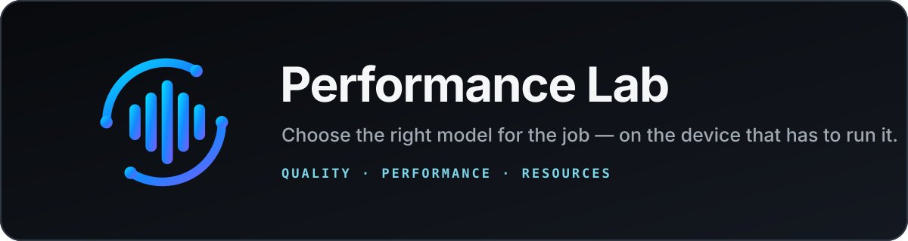

<p align="center">
  <a href="https://daniele21.github.io/">Mission</a> ·
  <a href="#why-performance-lab-exists">Why</a> ·
  <a href="#what-you-can-do-today">Today</a> ·
  <a href="#how-to-use-it">How to use it</a> ·
  <a href="#how-it-works">How it works</a> ·
  <a href="#current-status-and-limits">Status</a> ·
  <a href="docs/README.md">Docs</a>
</p>

<p align="center">
  <a href="https://github.com/daniele21/performance-lab/actions/workflows/validate.yml"></a>
  <a href="LICENSE"></a>
</p>

**Performance Lab helps you choose the right model and configuration for a specific workload and device.**

It measures quality, speed and resource use separately, then keeps the evidence behind the decision.

## Why Performance Lab exists

I'm exploring [how much AI can move from the cloud to infrastructure and devices we control](https://daniele21.github.io/), and where Local, Hybrid or Cloud actually makes sense.

That decision needs measurements. Local AI is not better just because it is local.

Performance Lab asks:

> **For this use case on this device, which available model and configuration gives me the best evidence-backed trade-off?**

It is not a generic leaderboard. The answer depends on the workload, the hardware, the runtime and the quality bar you actually need.

## What you can do today

You can:

- **Find the best setup** for a use case, device and set of candidate models/configurations;
- **Test one model** against a frozen evaluation configuration;
- **Inspect sample evidence** instead of relying on one opaque score;
- **Compare compatible runs** with explicit execution identity;
- **Gate regressions** when changing model or runtime configuration;
- **Export evidence** as portable `.plab.zip` bundles.

Quality, performance and resources stay separate. Missing evidence stays missing; it is never turned into a fake zero.

## See the product

<table>
  <tr>
    <th>Find best setup</th>
    <th>Test a model</th>
    <th>Inspect evidence</th>
  </tr>
  <tr>
    <td align="center"><a href="docs/assets/readme/find-best-setup.png"></a></td>
    <td align="center"><a href="docs/assets/readme/test-a-model.png"></a></td>
    <td align="center"><a href="docs/assets/readme/sample-evidence.png"></a></td>
  </tr>
</table>

These screenshots show the current browser product. They are not physical-device performance evidence.

## How to use it

Performance Lab evaluates an externally served OpenAI-compatible model endpoint. Model loading and runtime lifecycle stay outside the lab.

### 1. Install the project

```bash
git clone https://github.com/daniele21/performance-lab.git
cd performance-lab

uv python install 3.12
uv sync --extra dev --locked

corepack enable
corepack install --global pnpm@11.24.0
pnpm --dir frontend install --frozen-lockfile
```

### 2. Point it at a model

Probe the endpoint first:

```bash
uv run --extra dev --locked performance-lab probe \
  --base-url http://127.0.0.1:1235/v1/ \
  --model my-model
```

Then create a run configuration. The shortest working example and all supported fields are in [`docs/getting-started.md`](docs/getting-started.md) and [`docs/run-config-reference.md`](docs/run-config-reference.md).

### 3. Start the browser product

```bash
pnpm --dir frontend run build

uv run --extra dev --locked performance-lab-ui \
  --config local-run.json \
  --assets frontend/dist
```

Open:

```text
http://127.0.0.1:8765
```

From there, use **Test a model** for one explicit run or **Find best setup** to compare candidates for a real use case.

## How it works

```text
Use case + target device
          |
          v
Relevant dataset / evaluator
          |
          v
Models x quantizations x configurations
          |
          v
Quality   Performance   Resources
          |
          v
Compatibility check
          |
          v
Decision backed by evidence
```

Performance Lab keeps a few rules strict:

- **Use case first.** A benchmark matters only if it says something useful about the workload.
- **Execution identity matters.** Model name alone is not enough.
- **Success is not correctness.** A request can run successfully and still return the wrong answer.
- **Compatibility comes before comparison.** Incompatible evidence is not ranked anyway.
- **Completed evidence is immutable.** Runs and dataset snapshots remain reproducible.

The current text-generation boundary uses:

```text
GET  /v1/models
POST /v1/chat/completions
```

Korgis / Local LLM Server can also provide runtime identity and telemetry to enrich the evidence, but it is not required.

See [`docs/local-llm-server-integration.md`](docs/local-llm-server-integration.md).

## Current status and limits

The current local text-generation product scope is software-complete on `dev`.

The integrated browser experience includes Overview, **Find best setup**, **Test a model**, Runs, Run Detail, Compare, sample evidence, Library and Settings.

What is still separate from software completeness:

- representative real model/runtime/device evidence;
- later device-aware optimization and regression value slices;
- representative human accessibility/usability acceptance for stronger UX claims.

Hosted CI proves product behavior at its declared fidelity. It does not prove physical-device latency, memory, thermal behavior or repeated-load performance.

See [`docs/current-state.md`](docs/current-state.md) for the exact current frontier.

## Documentation

| Need | Start here |
| --- | --- |
| First run | [`docs/getting-started.md`](docs/getting-started.md) |
| Current state | [`docs/current-state.md`](docs/current-state.md) |
| Run configuration | [`docs/run-config-reference.md`](docs/run-config-reference.md) |
| Evaluation semantics | [`docs/evaluation-and-benchmarking.md`](docs/evaluation-and-benchmarking.md) |
| Evidence and bundles | [`docs/output-and-evidence-reference.md`](docs/output-and-evidence-reference.md) |
| Architecture | [`docs/architecture.md`](docs/architecture.md) |
| Troubleshooting | [`docs/troubleshooting.md`](docs/troubleshooting.md) |
| Documentation index | [`docs/README.md`](docs/README.md) |

## Develop and validate

Contributors work from `dev` and follow [`AGENTS.md`](AGENTS.md). Canonical commands live in [`.engineering/commands.json`](.engineering/commands.json).

Common deterministic checks:

```bash
uv run --extra dev --locked python scripts/validate.py
pnpm --dir frontend run check
pnpm --dir frontend run test
pnpm --dir frontend run build
```

## License

MIT. See [`LICENSE`](LICENSE).

Built by [Daniele Moltisanti](https://daniele21.github.io/) as the measurement layer of a broader Local AI effort: build an option, measure it, then decide Local, Hybrid or Cloud.
